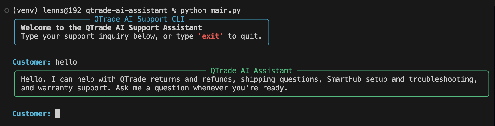
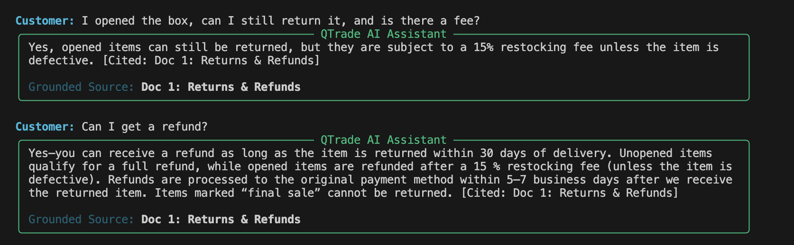
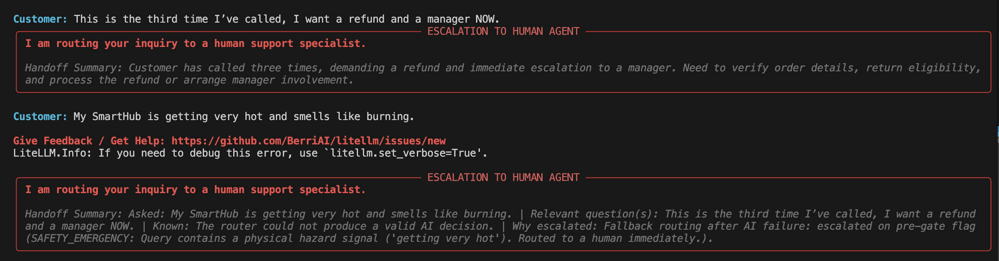
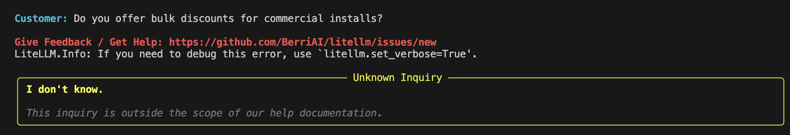

# QTrade AI Support Assistant

A small RAG assistant for QTrade's help docs. It answers questions from four
help documents, cites the doc it used, says **"I don't know"** when the answer
isn't in the docs, and hands off to a human when it shouldn't answer.

It runs for free: local embeddings plus a free-tier or local LLM.

## What it does

- Reads the four help docs and embeds them locally with `sentence-transformers`
  (`all-MiniLM-L6-v2`), stored in an in-memory ChromaDB collection.
- Finds the top-k closest docs for a question.
- Answers with a citation (`[Cited: Doc N: …]`) using a strict, temperature-0
  prompt, or replies "I don't know." when the docs don't cover it.
- Replies directly to greetings and "what can you do?" questions.
- Uses an LLM router to decide whether to answer or hand off to a human, and
  writes a short handoff summary for the agent when it does.
- Runs as a command-line app, with an optional HTTP API.

## How it works

```
question
  │
  ├─▶ Gate 1  Word check before search
  │           safety words ("burning", "smoke", …) / human requests
  │             ("a manager", "speak to a person") → flag for hand-off
  │           greeting / "what can you do?" → answer directly, no search
  │
  ├─▶ Search  embed question → top-k from the vector store
  │
  ├─▶ Answer  grounded, temperature-0 LLM call
  │           cites the doc, or says "I don't know."
  │
  └─▶ Router  LLM decides respond vs. escalate, using the query, context,
              draft answer, and history. On escalate it returns a specialist
              label and a short handoff summary. Falls back to deterministic
              routing if the LLM call fails.
```

Files:

| Path                  | Job                                                |
| --------------------- | -------------------------------------------------- |
| `src/ingest.py`       | Read the 4 docs, tag each with its title, index it |
| `src/vector_store.py` | In-memory ChromaDB wrapper (cosine distance)       |
| `src/escalation.py`   | Gate 1 word checks + the LLM routing decision      |
| `src/pipeline.py`     | Runs Gate 1 → search → answer → router             |
| `src/schema.py`       | Pydantic response models                           |
| `src/cli.py`          | Terminal UI                                        |
| `src/config.py`       | Models, top-k, threshold, prompts                  |

## How to run

Needs Python 3.10+.

```bash
# 1. Install
python -m venv .venv && source .venv/bin/activate
pip install -r requirements.txt

# 2. Set up the LLM
cp .env.example .env   # then edit .env
```

- **Groq free tier (default):** get a free key at
  <https://console.groq.com/keys> and set `GROQ_API_KEY` in `.env`.
- **Fully local, no API:** install [Ollama](https://ollama.com), run
  `ollama pull llama3.2`, and set `LLM_MODEL=ollama/llama3.2` in `.env`.

```bash
# 3. Run the CLI
python main.py
```

Ask things like _"Can I return an opened item?"_ or _"How do I reset my
SmartHub?"_. Type `exit` to quit.

## Example interactions

Sample CLI runs against the queries from the challenge document.

**1. Greeting — answered directly, no search**

> hello



**2. Answerable — cited from the help docs**

> I opened the box, can I still return it, and is there a fee?



**3. Escalations — explicit human request and safety issue**

> This is the third time I've called, I want a refund and a manager NOW.
>
> My SmartHub is getting very hot and smells like burning.



The first is a router-decided escalation with an LLM-written handoff summary; the
second is the fail-safe fallback (the router call failed), which still escalates
because the lexical pre-gate flagged the safety hazard.

**4. Out of scope — "I don't know"**

> Do you offer bulk discounts for commercial installs?



Optional stretch implemented; on every escalation the assistant attaches a **handoff summary** (what was asked,
what's known, why it escalated) so a human can pick it up at a glance.

Escalating to a human is also the **fail-safe**: when an LLM call fails — for
example a rate limit on the free tier — the pipeline does not guess. It falls
back to deterministic routing and hands off, which is why the escalation
examples above read _"Fallback routing after AI failure."_ The safety and
human-request cases still escalate correctly in that situation because the
lexical pre-gate flags them before any model call.

## Key decisions

**One doc = one chunk.** Each doc is only 3–4 sentences, so splitting it would
break apart facts that belong together. At this size the whole doc is the right
chunk. This is the first thing I'd change as the docs grow (see the write-up).

**In-memory store.** Four docs embed in well under a second at startup, so a
database on disk would add complexity for no speed gain.

**Lexical pre-gate, then an LLM router.** A fast word check handles the clear
cases first: safety words and explicit human requests are flagged for hand-off,
and greetings / "what can you do?" are answered directly without search. For
everything else, an LLM router looks at the query, retrieved context, draft
answer, and history to decide respond vs. escalate. If the router call fails, it
falls back to deterministic routing.

**Handoff summaries.** When the assistant escalates, it returns a short summary
(what was asked, what's known, why it escalated) so a human can pick it up at a
glance.

**Grounding.** A strict temperature-0 prompt, a fixed "I don't know." fallback,
and a step that links the answer back to a retrieved doc's title.

**Stateless answers.** Past turns are not fed into the grounded prompt, so
earlier answers can't sneak in as context and weaken the "only use the docs"
rule. History is still used by the router and the handoff summary.

### How the sample queries route

| Query                                                          | Result                     |
| -------------------------------------------------------------- | -------------------------- |
| "I opened the box, can I still return it, and is there a fee?" | Answer (Doc 1)             |
| "How do I reset my SmartHub?"                                  | Answer (Doc 3)             |
| "My order hasn't shipped in 4 days, where is it?"              | Answer (Doc 2)             |
| "My SmartHub is getting very hot and smells like burning."     | Hand off — safety          |
| "…I want a refund and a manager NOW."                          | Hand off — human request   |
| "Do you offer bulk discounts for commercial installs?"         | Off-topic → "I don't know" |

## What I'd do next

- **Deterministic safety short-circuit:** escalate safety / explicit-human
  requests before any LLM call, so a safety hand-off can never depend on the
  router. Keep the router for the ambiguous middle.
- **Smarter safety detection:** pair the word check with a binary safety
  classifier (fail-safe: escalate on any signal) to catch phrasings regex misses.
- **Robust citations:** return `{answer, cited_doc}` as structured output instead
  of string-matching the `[Cited: …]` tag.
- **Evaluation harness:** score answer quality across the sample queries.

See [`DESIGN_WRITEUP.md`](./DESIGN_WRITEUP.md) for the design questions.
